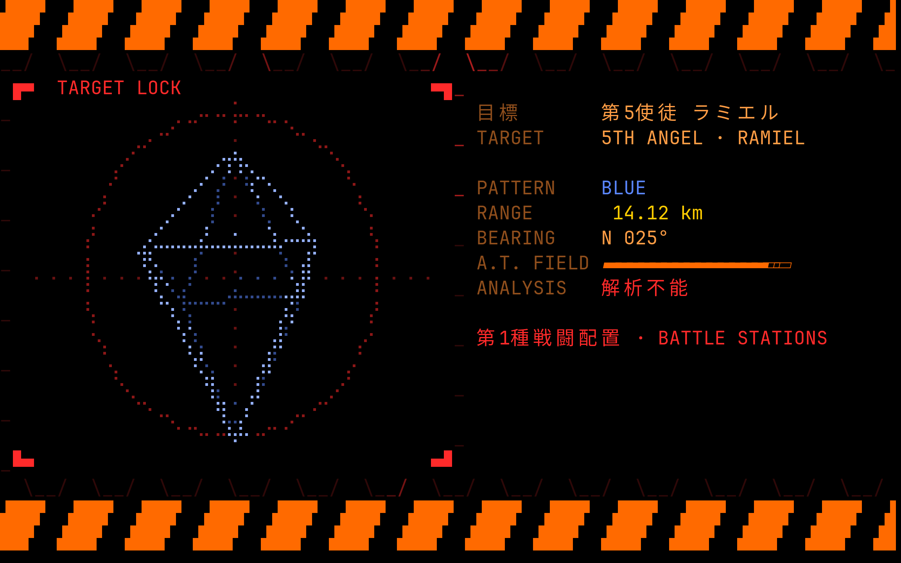
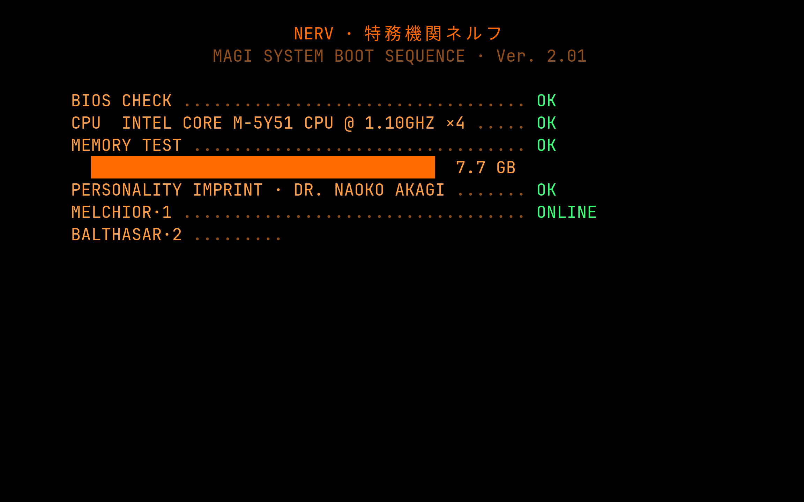

# MAGI

A NERV-style terminal screensaver for [Omarchy](https://omarchy.org).

It boots like the MAGI system itself, checking your real CPU and memory and
bringing MELCHIOR, BALTHASAR and CASPER online one by one. Then the three
supercomputers deliberate one proposal after another: each blinks 審議中
while it thinks, votes 承認 (approve) or 否決 (reject), and the verdict lands
underneath. A.T. Field shockwaves roll across the hex grid, Units 00, 01 and
02's sync ratios trace an oscilloscope, and the MAGI log mixes flavor text
with your machine's real load, memory, battery, temperature and uptime.

Every few minutes, PATTERN BLUE: an EMERGENCY alert, then Ramiel, the fifth
Angel, tumbling in a targeting reticle as its range closes in.

Colors come from the current Omarchy theme, so it fits any theme. It's written
in Rust and draws with braille characters for 2×4 dots per cell.




| Boot | PATTERN BLUE |
| --- | --- |
|  |  |

## Build and preview

It needs Rust (`mise use -g rust`, or `sudo pacman -S rust`) and a font with
Japanese glyphs, which Omarchy ships.

```sh
git clone https://github.com/roydq/omarchy-magi ~/.local/share/omarchy-magi
cd ~/.local/share/omarchy-magi
cargo build --release
./target/release/magi              # any key exits
./target/release/magi --alert      # start on a PATTERN BLUE alert
./target/release/magi --no-boot    # skip the boot sequence
```

`MAGI_HOST` replaces the hostname shown in the footer. `MAGI_FPS` sets the
frame rate (default 15). Most of the CPU cost is the terminal redrawing each
frame, so lower it to save battery.

## Use it as the Omarchy screensaver

Omarchy's screensaver launcher opens a fullscreen terminal on each monitor and
runs `omarchy-screensaver` inside it. MAGI takes that command's place, so the
idle timer, the lock screen and multi-monitor handling all stay Omarchy's.

Omarchy puts its own commands first on the desktop's `PATH`, so replacing one
takes an overrides directory placed ahead of them:

```sh
# Link MAGI in as omarchy-screensaver
mkdir -p ~/.local/share/omarchy-overrides/bin
ln -s ~/.local/share/omarchy-magi/target/release/magi ~/.local/share/omarchy-overrides/bin/omarchy-screensaver

# Put the overrides directory first on Hyprland's PATH
cp ~/.local/share/omarchy-magi/omarchy-overrides.lua ~/.config/hypr/
echo 'require("hypr.omarchy-overrides")' >> ~/.config/hypr/hyprland.lua
hyprctl reload
```

Then `omarchy launch screensaver force` shows it right away, or wait for the
idle timeout. To go back to Omarchy's screensaver, delete the
`omarchy-screensaver` link. The screensaver doesn't see your shell's
environment, so set `MAGI_FPS` or `MAGI_HOST` for it with
`hl.env("MAGI_FPS", "10")` in your Hyprland config.

Open Omarchy pull requests would replace this setup with a setting:
[#9493](https://github.com/omacom/omarchy/pull/9493) (screensaver plugins) and
[#10483](https://github.com/omacom/omarchy/pull/10483)
(`idle.screensaverCommand`).

## Credits

An unofficial fan work, not affiliated with or endorsed by the makers of
*Neon Genesis Evangelion*. NERV, MAGI and Evangelion belong to their
respective owners.

## License

[MIT](LICENSE)
