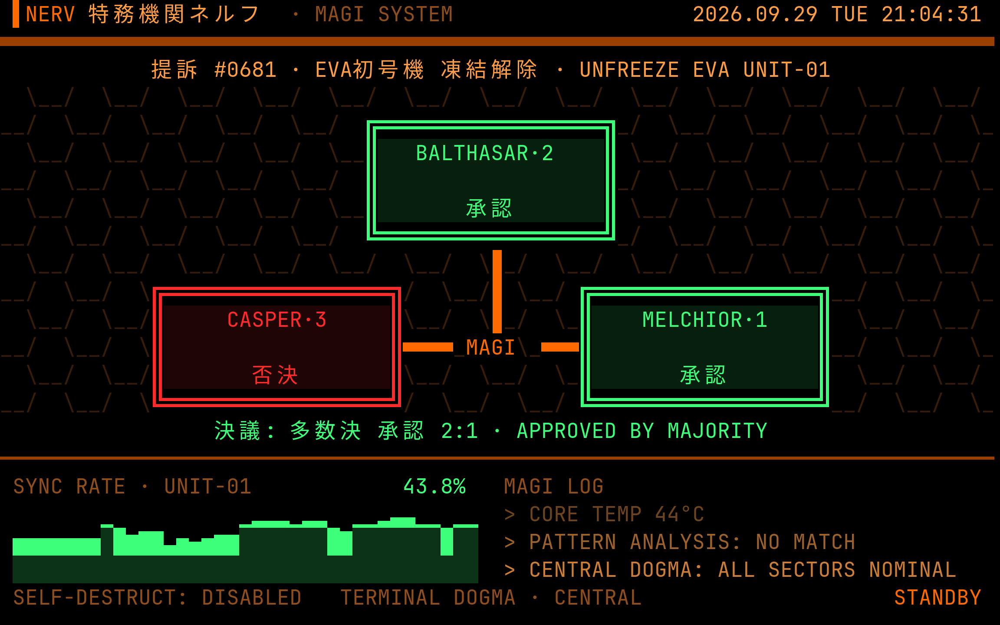
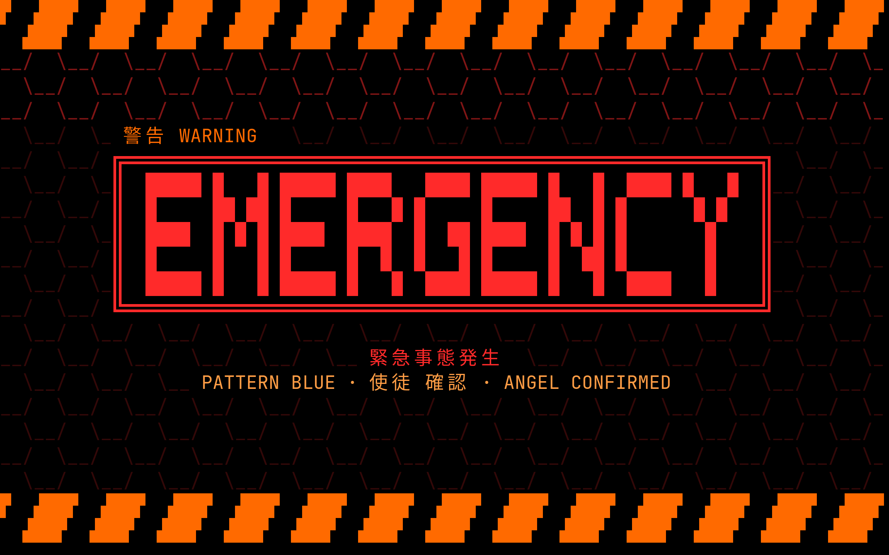

# MAGI

A NERV-style terminal screensaver for [Omarchy](https://omarchy.org).

The three MAGI supercomputers deliberate one proposal after another over a
hex grid: BALTHASAR, CASPER and MELCHIOR each blink 審議中 while they think,
then vote 承認 (approve) or 否決 (reject), and the verdict lands underneath.
Below them, Unit-01's sync rate scrolls by next to a MAGI log that mixes
flavor text with your machine's real load, memory, battery, temperature and
uptime. Every few minutes a PATTERN BLUE alert takes over the screen.

Colors come from the current Omarchy theme, so it fits any theme. It redraws
only the cells that change, at 10 fps.





## Preview

```sh
git clone https://github.com/roydq/omarchy-magi ~/.local/share/omarchy-magi
~/.local/share/omarchy-magi/magi            # any key exits
~/.local/share/omarchy-magi/magi --alert    # start on the alert
```

It needs Python 3 and a font with Japanese glyphs, both of which Omarchy
ships. `MAGI_HOST` replaces the hostname shown in the footer.

## Use it as the Omarchy screensaver

Omarchy's screensaver launcher opens a fullscreen terminal on each monitor and
runs `omarchy-screensaver` inside it. MAGI takes that command's place, so the
idle timer, the lock screen and multi-monitor handling all stay Omarchy's.

Omarchy puts its own commands first on the desktop's `PATH`, so replacing one
takes an overrides directory placed ahead of them:

```sh
# Link MAGI in as omarchy-screensaver
mkdir -p ~/.local/share/omarchy-overrides/bin
ln -s ~/.local/share/omarchy-magi/magi ~/.local/share/omarchy-overrides/bin/omarchy-screensaver

# Put the overrides directory first on Hyprland's PATH
cp ~/.local/share/omarchy-magi/omarchy-overrides.lua ~/.config/hypr/
echo 'require("hypr.omarchy-overrides")' >> ~/.config/hypr/hyprland.lua
hyprctl reload
```

Then `omarchy launch screensaver force` shows it right away, or wait for the
idle timeout. To go back to Omarchy's screensaver, delete the
`omarchy-screensaver` link.

Open Omarchy pull requests would replace this setup with a setting:
[#9493](https://github.com/omacom/omarchy/pull/9493) (screensaver plugins) and
[#10483](https://github.com/omacom/omarchy/pull/10483)
(`idle.screensaverCommand`).

## Credits

An unofficial fan work, not affiliated with or endorsed by the makers of
*Neon Genesis Evangelion*. NERV, MAGI and Evangelion belong to their
respective owners.

## License

[MIT](LICENSE)
